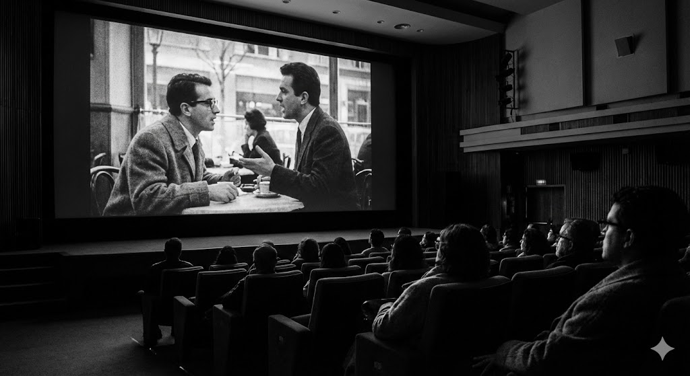

# 🗺️ Mapa dos Rolezinhos

<p align="center">
  
</p>

> **O guia definitivo da vida noturna, cultural e alternativa de Belo Horizonte.**

<p align="center">
    
    
    
</p>

## 💻 Sobre o Projeto

O **Mapa dos Rolezinhos** é uma Single Page Application (SPA) desenvolvida para conectar pessoas aos melhores eventos da cidade. O objetivo é centralizar a agenda cultural de BH, permitindo filtrar eventos por categorias como Vida Noturna, Cultura, Gastronomia e Geek.

Diferente de uma página estática comum, esta aplicação consome dados dinamicamente, utiliza APIs de geolocalização e permite a gestão de conteúdo (CRUD) pelos administradores.

---

## 📸 Capturas de Ecrã (Screenshots)

<p align="center">
  
  &nbsp;&nbsp; 
   &nbsp;&nbsp; 
</p>
<p align="center">
  <i>Visualização do painel principal, detalhes do evento e responsividade mobile.</i>
</p>

---

## ✨ Funcionalidades Principais

* 🔐 **Autenticação Social:** Login integrado com **Google Firebase**.
* 🗺️ **Mapas Interativos:** Integração com **Leaflet API** e **OpenStreetMap** para mostrar a localização exata dos eventos na página de detalhes.
* 📍 **Geocoding:** Conversão automática de endereços em coordenadas (Latitude/Longitude) via API Nominatim no cadastro de eventos.
* ❤️ **Sistema de Favoritos:** Persistência de dados via **LocalStorage** (os seus favoritos ficam salvos no navegador).
* 🔍 **Busca Inteligente:** Filtre rolezinhos por nome na barra de pesquisa ou por botões de categoria.
* 📝 **Painel Administrativo:** Interface exclusiva (protegida por login) para criar e editar eventos.
* 🎨 **UI Moderna:** Design responsivo com Bootstrap 5 e efeitos visuais de *Glassmorphism*.

---

## 🛠️ Tecnologias Utilizadas

### Frontend
* **HTML5 & CSS3** (CSS Variables, Flexbox & CSS Grid)
* **JavaScript (ES6+)** (ES Modules, Async/Await, Fetch API)
* **Bootstrap 5.3** (Framework CSS para responsividade e componentes)

### Integrações & APIs
* **Firebase Auth:** Gestão de utilizadores e login seguro com Google.
* **Leaflet.js:** Biblioteca para renderização de mapas interativos.
* **Nominatim API:** Serviço de geocodificação (Endereço ↔️ Coordenadas).
* **SweetAlert2:** Biblioteca para alertas e modais bonitos e responsivos.

### Dados
* **JSON Local:** Base de dados simulada (`db/db.json`) consumida via `fetch()`.

---

## 🚀 Como Executar o Projeto

⚠️ **Atenção:** Este projeto utiliza **Módulos ES6** (`import/export`) e requisições `fetch` para carregar dados. Por motivos de segurança do navegador (políticas CORS), ele **não** funcionará se abrir o ficheiro `index.html` diretamente com duplo clique.

É necessário usar um servidor local. A forma mais fácil é usando a extensão **Live Server** do VS Code.

### Passo a Passo

1.  **Clone o repositório:**
    ```bash
    git clone [https://github.com/engsoftmarcelo/mapa-dos-rolezinhos.git](https://github.com/engsoftmarcelo/mapa-dos-rolezinhos.git)
    ```

2.  **Abra a pasta do projeto no VS Code.**

3.  **Instale a extensão "Live Server"** (caso não tenha).

4.  **Inicie o Servidor:**
    * Clique com o botão direito no ficheiro `index.html` na barra lateral do VS Code.
    * Selecione a opção **"Open with Live Server"**.

5.  **Aceda no Navegador:**
    * O projeto abrirá automaticamente no seu navegador padrão (geralmente em `http://127.0.0.1:5500`).

---

## 📂 Estrutura do Projeto

A organização do código segue uma estrutura MVC simplificada voltada para front-end:
mapa-dos-rolezinhos/ │ ├── assets/ │ ├── css/ │ │ └── style.css # Estilos globais, variáveis CSS e animações │ └── scripts/ │ ├── app.js # Controlador principal: manipulação do DOM e eventos │ └── firebase.js # Configuração e inicialização do Firebase │ ├── db/ │ └── db.json # "Backend" simulado: contém os dados dos eventos e categorias │ ├── imgs/ # Imagens dos eventos, ícones e assets do sistema │ ├── index.html # Página Inicial (Dashboard, Destaques e Barra de Busca) ├── todos.html # Listagem completa dos eventos (View "Ver Todos") ├── detalhes.html # Visualização única do evento (inclui o mapa Leaflet) ├── favoritos.html # Página com os eventos salvos no LocalStorage ├── categoria.html # Template para listagem filtrada por categoria ├── cadastro.html # (Admin) Formulário para adicionar novo evento ├── editar.html # (Admin) Formulário para alterar evento existente └── 404.html # Página de erro personalizada
---

## 👨‍💻 Desenvolvedor

<table>
  <tr>
    <td align="center">
      <a href="https://github.com/engsoftmarcelo">
        <br>
        <sub><b>Marcelo Gomes</b></sub>
      </a>
    </td>
  </tr>
</table>

* [LinkedIn](https://www.linkedin.com/in/marcelogojunior)
* [GitHub](https://github.com/engsoftmarcelo)

---

<p align="center">
  Desenvolvido com 💜 em Belo Horizonte, MG.
</p>
